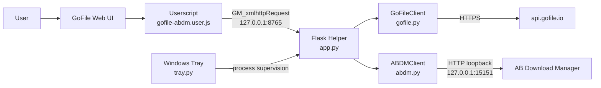
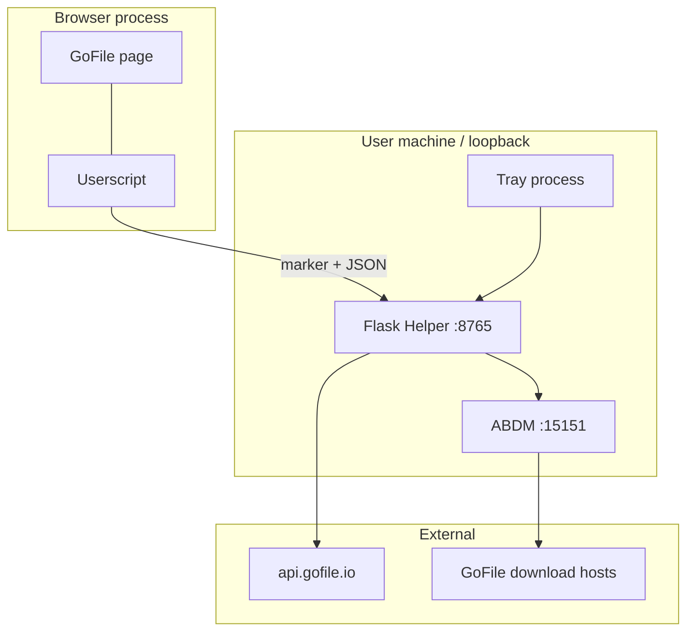
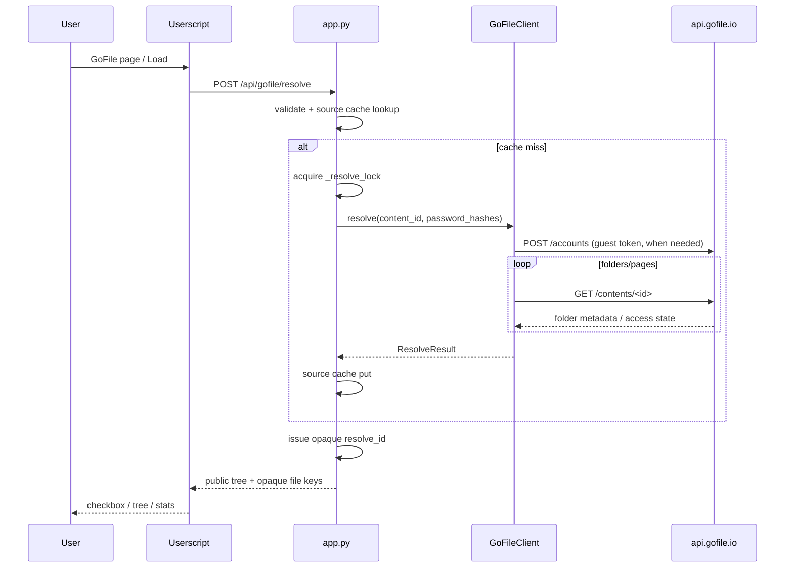
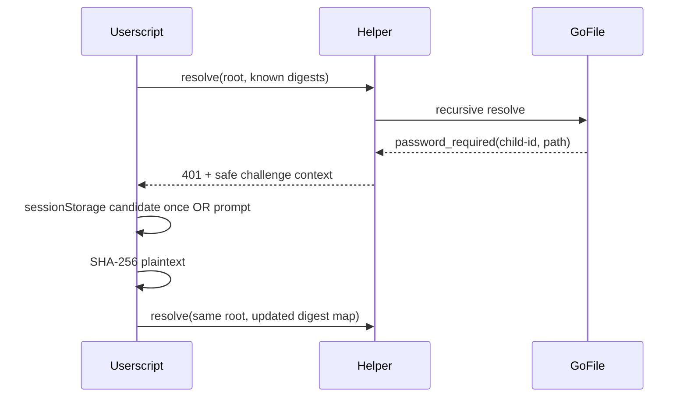
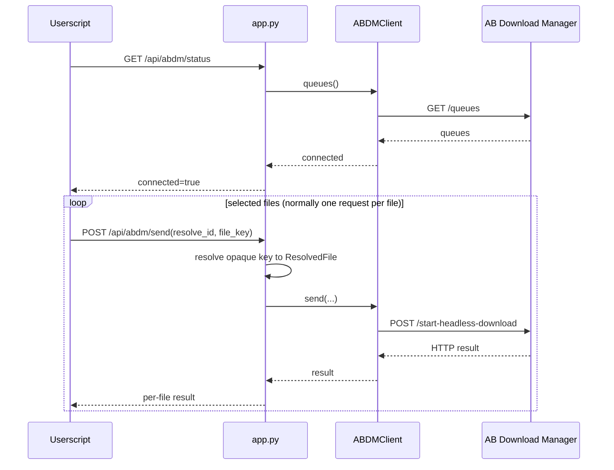

# アーキテクチャ

この文書は GoFile ABDM Helper の内部構造、trust boundary、データフローをまとめます。関数単位の詳細、既知問題、開発ルールは [`../DEVELOPMENT.md`](../DEVELOPMENT.md) を参照してください。

調査基準日: **2026-09-14**  
調査時 `main` HEAD: `8359b5fb2d09d0919aedcdc72418994441126c3a`

---

## 1. 全体構成



### コンポーネントの境界

- **GoFile Web UI**: 第三者サービス。DOM は将来変化し得る。
- **Userscript**: ブラウザ上の UI / 選択 /設定 / localhost 通信を担当。
- **Flask Helper**: ブラウザと GoFile / ABDM の間に置く localhost 専用 broker。
- **GoFileClient**: GoFile API の認証相当処理と再帰解決。
- **ABDMClient**: 公開 REST API による queue 取得 / task 登録。
- **Windows Tray**: Helper の起動監視のみ。業務ロジックを持たない。

---

## 2. Trust boundary



重要な設計判断:

1. Helper は `127.0.0.1` のみに bind する。
2. ABDM も `127.0.0.1:15151` 固定で、ユーザー入力の任意 host へ proxy しない。
3. Userscript から Helper への `/api/*` は `X-GoFile-ABDM: 1` marker を要求する。
4. GoFile 入力は bare content ID または `https://gofile.io/d/<id>` に限定する。
5. 解決後の download URL は HTTPS かつ `gofile.io` / subdomain であることを検証する。
6. direct URL、Cookie、guest token は Userscript へ渡さず、Helper の memory 内に閉じる。

localhost は「無条件に安全」ではありません。Web page から localhost service を狙えるため、この境界は維持してください。

---

## 3. Resolve データフロー



### パスワード challenge

途中 folder が `password_required` / `wrong_password` になった場合、部分ツリーを成功として返しません。



各 folder の credential は「明示指定 digest → 親から継承」の順で選ばれます。

---

## 4. Send データフロー



ABDM へ渡す `downloadSource.headers` には GoFile download 用 Cookie / User-Agent / Referer が含まれ得ます。これは ABDM へファイルを取得させるために必要ですが、ログや Userscript UI へ露出させません。

---

## 5. データモデル

### `ResolvedFile`

Helper 内部だけで使用します。

主なフィールド:

- opaque `key`
- GoFile `id`
- original `name`
- sanitized `safe_name`
- `size`
- sanitized target 用 `relative_folder`, `relative_path`
- GoFile `link`
- download `headers`
- `download_page`

### `ResolvedNode`

Userscript へ公開可能な tree model です。

- file / folder
- ID / key / name
- size / aggregate size
- relative path
- descendant file keys
- children

`to_public_dict()` は direct URL / Cookie を含みません。

### `ResolveResult`

- root content ID
- root name
- root tree
- `file_key -> ResolvedFile` map

Userscript から送信される file key を Helper 内部情報へ再結合する境界になります。

---

## 6. キャッシュと排他

### `_source_cache`

目的:
- 同じ content tree を短時間に GoFile API へ再取得することを避ける。

key:

```text
(root content ID, SHA-256(canonical credential map))
```

credential map は content ID 順で正規化し、digest を小文字化したうえでさらに SHA-256 します。平文 password を key に保存しません。

TTL: 20分。

### `_cache`

目的:
- Userscript の opaque `resolve_id` を Helper 内の `ResolveResult` へ対応させる。

TTL: 20分。

### `_resolve_lock`

recursive GoFile resolve を Helper process 内で1本に直列化します。

lock 待ち後に source cache を再確認するため、同一 resolve が重なった場合、後続 request は不要な GoFile API access を避けられます。

---

## 7. GoFile request model

### Guest account

`POST https://api.gofile.io/accounts`

成功 token は同じ Helper process の `GoFileClient` で再利用します。

### Website Token

現在の実装は次の入力を連結し SHA-256 します。

```text
User-Agent :: language :: guest token :: 4-hour window :: salt
```

`GOFILE_WT_SALT`, `GOFILE_USER_AGENT`, `GOFILE_LANGUAGE` で上書き可能です。

### Folder API

`GET https://api.gofile.io/contents/<id>`

- page size: 1000
- pagination 対応
- password digest を query parameter `password` に渡す経路あり
- HTTP 429 は JSON parse 前に検出
- `status: ok` でも `data.canAccess is False` は成功扱いしない

### Request pacing

デフォルト 0.75秒。

rate limit が出た場合に retry して request を増幅させるのではなく、その resolve を止めます。

---

## 8. Path model

GoFile 由来の path segment は `sanitize_segment()` を通します。

対象例:

- `/`, `\`
- `:*?"<>|`
- NUL / control chars
- `.` / `..`
- Windows reserved names (`CON`, `NUL`, `COM1` 等)
- 末尾の dot / space

segment は最大240文字です。

一方、ユーザー指定 `save_root` は ABDM 向けに separator を `/` へ正規化し、末尾 separator を落とす程度で、別の directory へ勝手に書き換えません。

### Structure mode

`preserve_structure=true`:

```text
<save_root>/<sanitized GoFile relative folder>
```

### Flat mode

`preserve_structure=false`:

```text
<save_root>
```

`save_root` が空なら `folder` field 自体を ABDM へ送りません。

このため、ABDM の未知の default folder に相対 subfolder だけを確実に追加する機能は現在ありません。

---

## 9. Browser DOM 統合

Userscript は GoFile の単一 class 名へ固定依存しないようにしています。

優先して見る ID 属性:

- `data-content-id`
- `data-id`
- `data-item-id`
- `data-uuid`

その後 link 内の content ID、最後に保守的な表示名一致へ fallback します。

さらに `Items` modal は DOM row mapping が壊れても解決済み tree から直接選択できる fallback です。

Helper resolve が失敗している間も、DOM に content ID が見えていれば provisional selection を保持できます。

---

## 10. Windows Tray の位置づけ

`tray.py` は Windows 専用です。

責務:

- single instance mutex
- Helper health check
- Helper process start / restart / stop
- `helper.log` への stdout/stderr redirect
- user-level Windows startup registration
- tray menu

Flask logic、GoFile resolve、ABDM send logicは持ちません。

外部からすでに port 8765 の Helper が稼働している場合は `Running (external)` と表示し、その process を tray から kill しません。

---

## 11. Failure boundary

### GoFile failure

- invalid input → resolve 開始前に reject
- 429 → 即停止
- password challenge → target context を返し、部分 tree は使わない
- generic upstream error → 502
- unexpected error → 500、秘密情報を detail に入れない

### ABDM failure

1 file の失敗が残りの file registration を止めない設計です。

ただし `POST /start-headless-download` の結果が network 上不明になった場合、現在 idempotency 判定はありません。自動 retry はしませんが、ユーザーが `Retry Failed` を選ぶと重複 task の可能性があります。

### Browser navigation

resolve は generation guard で stale response を捨てます。

一方、進行中の send loop は同じ generation guard を持たないため、navigation 中送信については [`../DEVELOPMENT.md`](../DEVELOPMENT.md) の既知問題を確認してください。

---

## 12. 設計上「追加していない」もの

現在のアーキテクチャは小さな localhost bridge を維持することを優先しており、次を持ちません。

- DB
- Redis / Celery
- server-side persistent queue
- Docker
- Flask HTML UI
- direct file streaming / Python downloader
- multi-user auth
- LAN server mode
- Premium account token UI
- generic URL downloader

これらを追加する場合は、「便利だから」ではなく trust boundary、credential lifecycle、crash recovery、migration を含めて設計を見直してください。

---

## 13. 正本の優先順位

仕様が食い違って見える場合は、次の順に確認してください。

1. 現在の `main` の実装
2. 現在の tests
3. `CHANGELOG.md` の `[Unreleased]`
4. `README.md` / `DEVELOPMENT.md` / この文書
5. 過去の実装計画・PR 説明

`Password-Protected-Folders-Luna-Implementation-Plan.md` は実装前の調査・計画資料を含むため、現在の API / behavior を確認する一次資料としては使わないでください。
