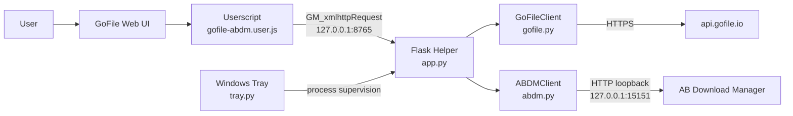
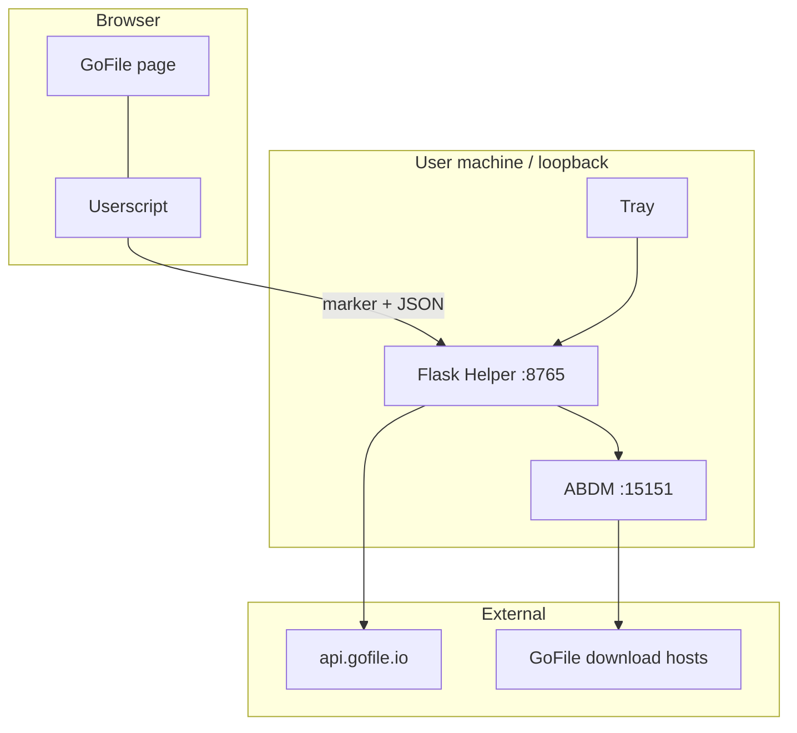
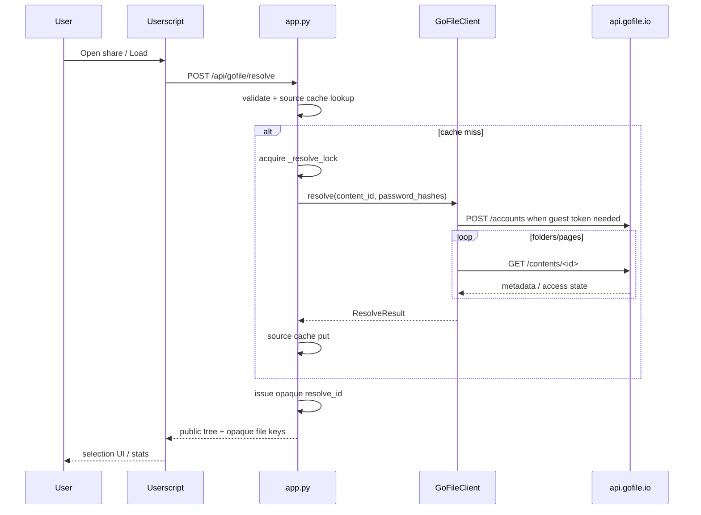
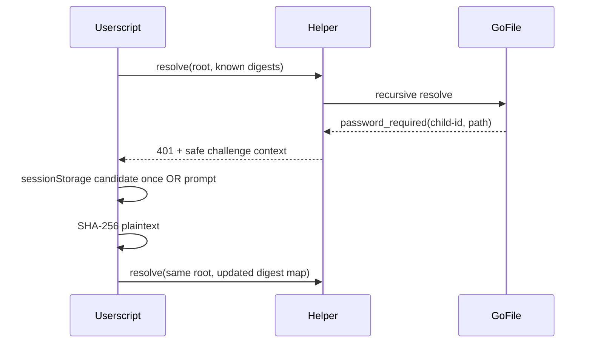
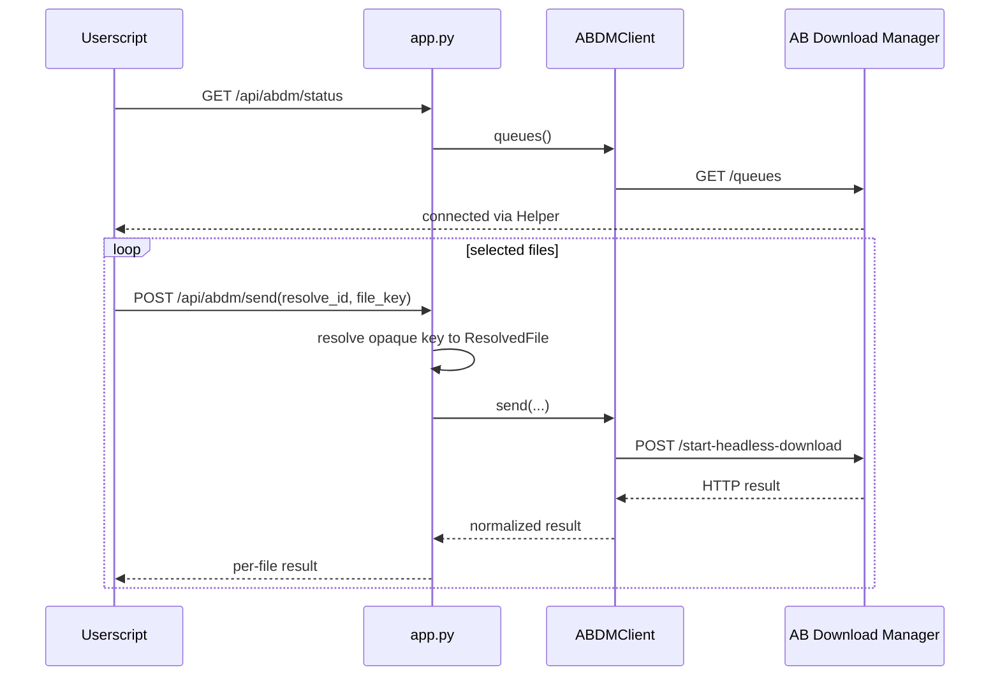

# アーキテクチャ

GoFile ABDM Helper `v1.0.0` の内部構造、trust boundary、データフローをまとめます。関数単位の詳細、既知問題、開発ルールは [`../DEVELOPMENT.md`](../DEVELOPMENT.md) を参照してください。

基準日: **2026-09-14**

---

## 1. 全体構成



### Component boundary

- **GoFile Web UI**: third-party service。DOM / API は将来変化し得る。
- **Userscript**: browser UI、selection、settings、password prompt、localhost communication。
- **Flask Helper**: browser と GoFile / ABDM の間に置く localhost-only broker。
- **GoFileClient**: guest session、Website Token、recursive resolve、path safety。
- **ABDMClient**: ABDM queue 取得 / task registration。
- **Windows Tray**: Helper process lifecycle / startup / log。business logic は持たない。

---

## 2. Trust boundary



守るべき境界:

1. Helper は `127.0.0.1` のみに bind。
2. ABDM は `127.0.0.1:15151` 固定。
3. `/api/*` は `X-GoFile-ABDM: 1` marker を要求。
4. mutation request は JSON を要求。
5. GoFile input は bare content ID または `https://gofile.io/d/<id>` に限定。
6. download URL は HTTPS + `gofile.io` / subdomain のみ許可。
7. direct URL / Cookie / guest token は Userscript へ返さず Helper memory に閉じる。

localhost は無条件に信頼できる境界ではないため、CORS 拡大・LAN bind・generic proxy 化を行わないでください。

---

## 3. Resolve data flow



### Password challenge

途中 folder が `password_required` / `wrong_password` になった場合、部分 tree を成功扱いしません。



credential priority:

```text
explicit digest for folder
        ↓ fallback
inherited parent digest
```

---

## 4. Send data flow



ABDM へ渡す `downloadSource.headers` には GoFile download 用 Cookie / User-Agent / Referer が含まれ得ます。これは ABDM へ file を取得させるために必要ですが、log / Userscript UI へ露出させません。

---

## 5. Data model

### `ResolvedFile`

Helper internal only:

- opaque `key`
- GoFile `id`
- original `name`
- sanitized `safe_name`
- `size`
- `relative_folder`, `relative_path`
- direct `link`
- download `headers`
- `download_page`

### `ResolvedNode`

Userscript へ公開可能な tree model:

- file / folder
- ID / key / name
- size / aggregate size
- relative path
- descendant file keys
- children

`to_public_dict()` は direct URL / Cookie を含みません。

### `ResolveResult`

```text
content_id
root_name
root tree
file_key -> ResolvedFile map
```

Userscript の opaque file key を Helper internal information へ再結合する境界です。

---

## 6. Cache / lock

### `_source_cache`

同じ content tree を短時間に GoFile API へ再取得することを避けます。

key:

```text
(root content ID, SHA-256(canonical credential map))
```

TTL: 20 minutes。

plaintext password を cache key に保存しません。

### `_cache`

opaque `resolve_id` → `ResolveResult`。

TTL: 20 minutes。

### `_resolve_lock`

recursive resolve を Helper process 内で1本に serialize します。

lock 待ち後に source cache を再確認するため、同一 resolve の重複 API access を抑えます。

---

## 7. GoFile request model

### Guest account

```text
POST https://api.gofile.io/accounts
```

成功 token は同じ Helper process で reuse。

### Website Token

概念上:

```text
SHA-256(User-Agent :: language :: guest-token :: 4-hour-window :: salt)
```

override:

- `GOFILE_WT_SALT`
- `GOFILE_USER_AGENT`
- `GOFILE_LANGUAGE`

### Folder API

```text
GET https://api.gofile.io/contents/<id>
```

- page size 1000
- pagination
- password digest query path
- HTTP 429 は JSON parse 前に detect
- `status: ok` でも `canAccess: false` は success にしない

### Pacing

デフォルト 0.75 sec。

rate limit は blind retry せず current resolve を stop。

---

## 8. Path model

GoFile-derived path segment は `sanitize_segment()` を通します。

対象:

- `/`, `\`
- `:*?"<>|`
- NUL / control characters
- `.` / `..`
- Windows reserved names
- trailing dot / space

user-selected `save_root` は ABDM 向け separator normalization 以上に勝手に変換しません。

### Structure mode

```text
<save_root>/<sanitized GoFile relative folder>
```

### Flat mode

```text
<save_root>
```

`save_root` empty の場合は `folder` field を ABDM へ送りません。

---

## 9. Browser DOM integration

priority:

- `data-content-id`
- `data-id`
- `data-item-id`
- `data-uuid`
- link content ID
- conservative filename text match

`Items` modal は DOM mapping が壊れても resolved tree から直接選択できる fallback です。

resolve failure 中も DOM に content ID があれば provisional selection を保持できます。

---

## 10. Windows Tray

`tray.py` は Windows only。

責務:

- single-instance mutex
- Helper health check
- Helper start / restart / stop
- stdout/stderr → `helper.log`
- current-user startup registration
- tray menu

external Helper が port 8765 で稼働している場合は `Running (external)` とし、その process を kill しません。

---

## 11. Failure boundary

### GoFile

- invalid input → pre-resolve reject
- 429 → immediate stop
- password challenge → target context + full resolve retry
- access denied → stop
- generic upstream error → 502
- unexpected error → 500 without secret details

### ABDM

1 file failure で remaining files を止めません。

一方、`POST /start-headless-download` が ABDM 側で成功したあと response だけ失われた場合、現在 idempotency check はありません。automatic blind retry はしませんが、manual `Retry Failed` では duplicate task の可能性があります。

### Browser navigation

resolve response は generation guard で stale state を破棄します。

send loop には同等の navigation cancellation guard がないため、send 中 navigation は [`../DEVELOPMENT.md`](../DEVELOPMENT.md) の known issue を参照してください。

---

## 12. Intentionally not implemented

- database
- Redis / Celery
- persistent server queue
- Docker
- Flask HTML UI
- Python direct downloader / streaming
- multi-user auth
- LAN server mode
- Premium account token UI
- generic URL downloader

追加する場合は credential lifecycle、trust boundary、crash recovery、migration を含めて再設計してください。

---

## 13. Source of truth

仕様確認の優先順位:

1. current `main` implementation
2. current tests
3. `CHANGELOG.md`
4. `README.md`
5. `DEVELOPMENT.md`
6. this architecture document
7. historical commits / PR descriptions

実装済み機能の旧計画書は repository から削除済みです。現在仕様を確認するときは、過去の計画資料ではなく code / tests / current documentation を使用してください。
